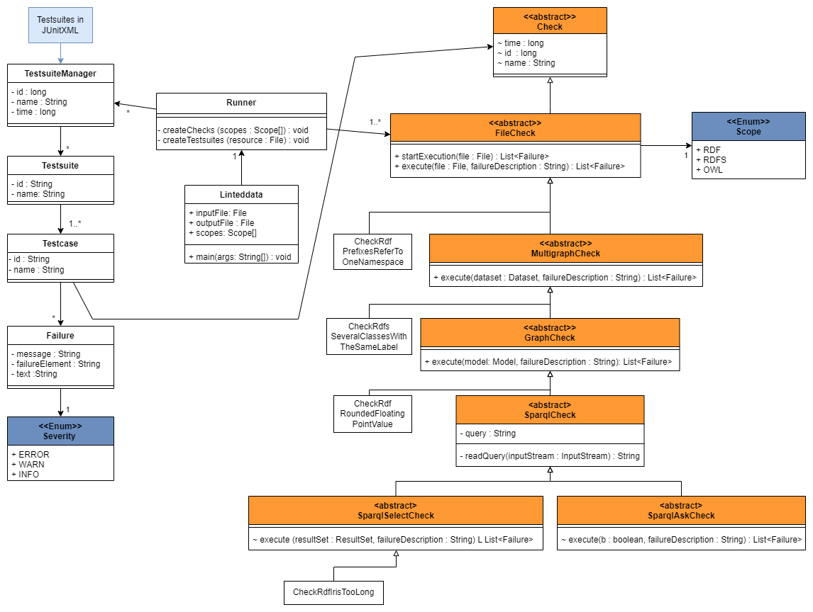

# How to add a new validator to LintedData  

The aim of this document is to enable the reader to extend the tool on his own.
Therefore, at first, the general structure of the classes within the tool is explained.
Afterwards, the different types of checks that are modelled are presented.
In this section ([check types](#check-types)), for each check type an example is given.
It is discussed why the check needs to be implemented at this level, but the implementation is left out.
Section [implementation of a new validator](#implementation-of-a-new-validator) is a general description which steps need to be followed, to add a new validator to the tool.

The tool can validate RDF data that uses RDF, RDFS, or OWL vocabulary.
It can't process files using the OWL/XML format.

## Table of contents

1. [General architecture](#general-architecture)
2. [Check types](#check-types)
    1. [FileCheck](#FileCheck)
    2. [MultiGraphCheck](#MultiGraphCheck)
    3. [GraphCheck](#GraphCheck)
    4. [SparqlCheck](#SparqlCheck)
3. [Implementation of a new validator](#implementation-of-a-new-validator)

## <a id="general-architecture"></a> General architecture  

In this section the architecture is displayed.
Additionally, some of the classes and their functionality are explained.

The general structure of the classes used to implement LintedData is displayed in the following image:

  

The classes belong to three different packages:

| Package         | Description     |
|--------------|-----------|
| *linted_data* | The classes in this package are used to execute the tool. |
| *linted_data.checks* | This package contains all the validators.     |
| *linted_data.JUnitXML*      | All classes in this package are used to build the structure of [JUnitXML](https://www.ibm.com/docs/en/developer-for-zos/14.1.0?topic=formats-junit-xml-format).  |

The different classes in the package `checks` are described in the section [checks types](#check-types).

In general, all of these classes have a function called `execute` that must be implemented.
Each of the abstract classes overwrites the `execute` of its superclass, except for `FileCheck` which is the first level.
`Check` is a superclass of `FileCheck` and is used to capture the general attributes of a check.
It can be used to extend the tool later with different types of checks.

Each of the `FileCheck`s has a `Scope`.
This attribute is used to assign the validator to the corresponding `Testsuite` in the result.
It represents the vocabulary that is needed to realise the checked concept.

The abstract subclasses of the different levels each implement the abstract `execute` method of their superclass.
Also, each of them defines a new abstract method called `execute`.
All `execute` methods have two arguments.
The arguments of each method are described in the section on the [implementation of a new validator](#implementation-of-a-new-validator).

The package `JUnitXML` contains classes that are needed to represent the elements in [JUnitXML](https://www.ibm.com/docs/en/developer-for-zos/14.1.0?topic=formats-junit-xml-format).
To prevent misunderstandings, elements of *Testsuites* are represented with instances of the class `TestsuiteManager`.
When adding a new validator, no changes need to be made to this package.

The `Severity` has the three possible values `ERROR, WARN`, and `INFO`.
Where `ERROR` is used for failure causes that prevent any use of the RDF data.
`WARN` represents failure causes that prevent use of the RDF data in many cases.
The weakest value is `INFO` which is for failure causes that prevent the use of the RDF data in some rare cases.

The `main`-method is contained in `LintedData`.
Within this class, the command-line arguments are processed, and a new instance of `Runner` is created.
The checks are only executed when the file can be parsed successfully; otherwise, the execution stops.
`Runner` executes the selected checks and stores the result in the destination file.
When a new validator is added, it must be added to the method `Runner.createAllChecks`.
There are no further changes needed.  

In the following section, the classes of the package `check` are described in more detail.

## <a id="check-types"></a> Check types  

In this section, the different types of validators are explained.
The aim of this section is to understand when to implement which type of check.

As seen in the class diagram in the previous section, the different types of validators are implemented as subclasses of `Check`.

A general rule is that a validator should be implemented as a subclass of the most specific check.
It is always possible to realise a validator as a subclass of `FileCheck`.
But this leads to code duplication that can be prevented.
Also, each level provides a method that only has the required arguments.

## <a id="FileCheck"></a> `FileCheck`

`FileCheck` is the most general check that applies to the structure of the tool.
All non-abstract subclasses of this class need to process the file in its raw format.
The failures detected in those classes can't be detected after parsing the file into a [Apache Jena](https://jena.apache.org/) dataset.  

**Example: `CheckRdfPrefixesReferToOneNamespace`**

One example for this type is the check if a prefix is defined multiple times, see `CheckRdfPrefixesReferToOneNamespace`.
This can only occur in serialisation languages that allow prefix definitions, for example, Turtle.
In Turtle and JSON-LD, it is possible to generate a valid document where a prefix is defined multiple times.
This bad practice can't be detected after parsing the file because then only the last set prefix definition would be available.

## <a id="MultiGraphCheck"></a> `MultiGraphCheck`

To easily interact with the file content, it is helpful to parse the file into an API.
In LintedData the [Apache Jena](https://jena.apache.org/) API is used therefore.
At this level, the file gets parsed into a `dataset`.
A `dataset` provides access to the default graph and, if serialised in a language supporting multiple graphs within one document, also to all other named graphs.
This level should be used when it is necessary to access all contained models and combine the results from them.

**Example: `CheckRdfsSeveralClassesWithTheSameLabel`**

The only example created at this level is `CheckRdfsSeveralClassesWithTheSameLabel`.
This check should be implemented as `MultiGraphSparqlCheck`, but this class doesn't exist yet.
It is not possible to realise this validator at another level because the other levels process the graphs contained in the `dataset` on their own.
Thus, it is not possible to get all the used labels from each model and check if they are also used for another concept.

## <a id="GraphCheck"></a> `GraphCheck`

A `GraphCheck` gains access to only one model, representing a single graph of a dataset, at the same time.
The statements contained within each graph can be directly accessed.
The statements of each graph contained in a dataset can also be accessed from the dataset itself, but in this case more effort is needed.

If it is necessary to combine results or statements from multiple graphs within a check, this must be implemented as a `MultiGraphCheck`.

**Example: `CheckRdfRoundedFloatingPointValue`**

Whether a value can be exactly represented as a double or float is an example of a `GraphCheck`.
In the check `CheckRdfRoundedFloatingPointValue`, each statement of a model is examined.
In the case that the object of a statement is a literal with the datatype `xsd:float` or `xsd:double`, it is checked if this lexical value can be exactly represented in this datatype or if its datatype should be `xsd:decimal`.
The comparison of the `decimal` value and the `double` or `float` value can't be realised as a SPARQL query.
So this validator can't be realised as `SparqlCheck`.

## <a id="SparqlCheck"></a> `SparqlCheck`

Checks that can be formulated as a SPARQL query are a subclass of `SparqlCheck`.
Although implementing a validator as a subclass of `SparqlCheck` might not be the most efficient solution, it should be the superclass to choose.
This enables the reuse of the SPARQL to check RDF data provided by (remote) SPARQL endpoints as well.

This abstract class, `SparqlCheck`, has an attribute in which the query is stored as a String.
`SparqlAskCheck` and `SparqlSelectCheck` are its two abstract subclasses used to model and execute the different types of request queries in SPARQL.

`SparqlAskCheck` is used to model `ASK` queries.
It defines an abstract method with a boolean parameter that needs to be processed.
With `SparqlSelectCheck` `SELECT FROM WHERE` queries are modelled.
The abstract `execute` function has one argument of the type `ResultSet`.
This contains the answer from the SPARQL query and can then be processed further.

In both cases, it is only possible to access the result of the query, not the queried model.

**Example: `CheckRdfIrisTooLong`**

This validator checks if the locale name of an IRI, the part after `#` or after the last `/`, contains not more than 36 characters.
The limit of 36 characters is based on:

- Three IRIs should fit into one line
- IRIs should be easy to type
- UUIDs are 36 characters long and should not be detected when used as locale names

Since for each IRI whose locale name is longer than 36 characters, a failure entry should be created, this validator is realised as a subclass of `SparqlSelectCheck`.
A realisation as a `SparqlAskCheck` would only provide the answer if in a model there exists an IRI that is too long.

It would also be possible to implement this check without SPARQL.

The next section describes the procedure for implementing a new validator.

## <a id="implementation-of-a-new-validator"></a> Implementation of a new validator  

After describing the different types of checks that are included in LintedData, this section describes the steps that need to be followed when implementing a new validator.

The first step is to assign the validator a level.
The differences between those are described in the previous section.
The examples also given in the section may help to find a suitable level.
It may also help to ask what information is needed to solve the problem.
When choosing the level, it should be considered that the most appropriate class should always be chosen.

Next to choosing the level of the check, it must be considered to which `Scope` it applies.
The scope of a validator defines which common vocabulary the check applies to.
For example, `CheckRdfIrisTooLong` only uses the IRI concept from RDF.
Whereas `CheckRdfsSeveralClassesWithTheSameLabel` uses the concept Label from RDFS.
The validators are grouped by their `scope` for the different `Testsuite`s in `Runner` as well as in the exported XML result file.

The name of a check should describe the bad practise it detects.
The corresponding class name should be in *CamelCase* and follow the naming convention below:

```
Check<Scope><Check-Name>
```

All checks call the constructor of their abstract superclass.
They have the following arguments:  

| Argument         | Description |
|--------------|-----------------------|
| `scope`      | Corresponding semantic web modelling language, determines corresponding `Testsuite`, a value of `Scope`. |
| `severity` | How important it is to fix an occurring failure of this validator, see section [general architecture](#general-architecture) for a description of the different values. |
| `name`| This attribute does not describe the validator itself but is a general description of the failures found by the validator. |
| `query` | This attribute only applies to `SparqlCheck`s. It can be passed as `String`, file or `InputStream`.

All these arguments should be set in the constructor itself, so that the constructor itself doesn't require any arguments.

Besides the creation of a constructor, the implementation of the `execute` method is an essential step.
This function returns a list of `Failure`s and always has two arguments:

One argument is a `String` called `failureDescription`.
This argument is used to set the text attribute of a failure.
Later, the text will be the only option for the user to locate the failure within his file.
To help the user, the description gets specified with the more specific subclasses.
To keep the text formatted, the first character added to it must be a line break.
Afterwards, there should be added information that describes the element or elements that led to the failure.

Depending on the level, the second argument is different.
The content of `failureDescription` and the second argument for each level can be found in the following table.

| Level         | `failureDescription`     | 2nd argument |
|--------------|-----------|------------|
| `FileCheck` | Canonical path to the file | Raw file |
| `MultiGraphCheck` | Canonical path to the file | File parsed as a `dataset` |
| `GraphCheck` | Canonical path to the file; name of the model | Single model from the `dataset` |
| `SparqlSelectCheck` | Canonical path to the file; name of the model | `ResultSet` from the query
| `SparqlAskCheck` | Canonical path to the file; name of the model | `boolean` answer from the query

When creating a new failure and adding it to the list that will be returned at the end, the following information must be given:

| Argument | Description |
| ---------- | ----------- |
| `message` | Describes the error in a general way; in most cases, the attribute `name` of the check can be used. |
| `severity` | How critical the found error is. This information can also often be extracted from the attributes of the check. |
| `failureElement` | This is only for testing, not for a productive environment. This argument is used to describe what caused the failure. For example, the number that can't be represented exactly. |
| `text` | The description of the error position should be the extended  `failureDescription`. |

Before the validator is added to the tool, use JUnit tests to ensure its correctness.

The last step is to add the check to all the checks that are executed when the tool is executed.
Therefore, the function `createAllChecks` in the class `Runner` must be adopted.
Within this function, the new class must be added to the list `allChecks`.

That's the only needed change in this class.
When executing LintedData the next time, the check will also be executed if its `scope` is chosen.
No further steps are needed.
