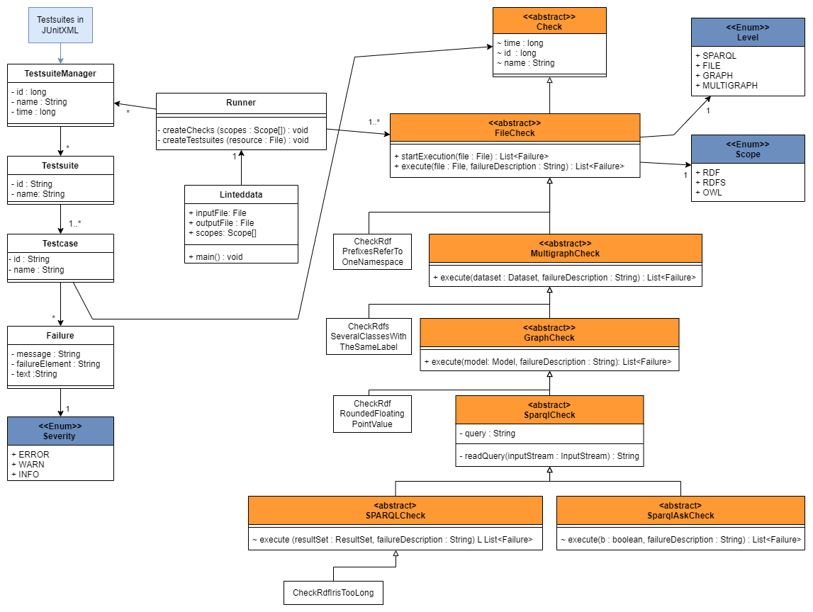

# How to add a new validator to LintedData  

## 1. Structure  
<!--describe the structure of this document-->

## 2. General architecture  

In this section at first the architecture is displayed.
Additionally some of the classes and their functionality are explained.  

The general structure of the classes, used to implement the LintedData, is displayed in the following image:  

  

The classes belong to three different packages:

<!-- TODO Cite -> Link -->
| Package         | Description     |
|--------------|-----------|
| *checks* | This package contains all the validators.     |
| *JUnitXML*      | All classes in this package are used to build the structure of \cite{JUnitXML_ibm}  |
| *Main* | The classes from this package are used to execute the tool. |

The different classes in the package `checks` are described in section 3.
<!-- TODO keep track of section number -->
In general all of these classes have a `execute` that must be implemented.
Each of the abstract classes overwrites the `execute` of its superclass, except for `FileCheck` as the first check.
`Check` is a superclass of `FileCheck` and used to capture the attributes of a check.
It can be used to extend the tool later with different types of checks.  

Each of the `FileCheck`s has one level it applies to, this could also be modelled via the subclass relation, but with the enum `Level`, the user can pass as an argument what kind of validations he wants to execute.
A new validator mustn't have the `Level` `ALL`, this value is only for the user input.
Also each one has a `TargetLanguage`.
This attribute is used to assign the validator to the corresponding Testsuite in the result.

The abstract subclasses of the different levels each implement the abstract `execute` method of its superclass.
In these implementations the argument, that is not `failureDescription`, is further processed and along with the `failureDescription` passed to the new abstract method `execute`.  

The package `JUnitXML` contains classes that are needed to represent the elements from \cite{JUnitXML_ibm}.
<!-- TODO cite -> link -->
To prevent misunderstandings, elements of *Testsuites* are represented with instances of the class `TestsuiteManager`.
When adding a new validator, no changes need to be done to this package.

The `Severity` has the three values `ERROR, WARN` and `INFO`.
Where `ERROR` is used for critical failures that must be fixed to ensure correctness and functionality.
`WARN` represents failures that are non critical but should be fixed for correct behaviour.
The weakest value is `INFO` which is for non critical failures that don't affect the correctness but should be fixed.  

The `main`-method is contained in `LintedData`.
Within this class the command-line arguments are processed and a new instance of `Runner` is created.
`Runner` executes the selected checks and stores the result to the destination file.
When a new validator is added, it must be added to the method `Runner.createAllChecks`, there are no further changes needed.  

In the following section the classes of the package `check` are described more in detail.
<!-- TODO
* should the classes be described more in detail?
* more details on failure? $\rightarrow$ most important class from JUnitXML
* Apache Jena for parsing, processing?
-->
## 3. Check types  

In this section the different types of validators are explained.
The aim of this section is it, to understand, when to implement which type of check.

As seen in the class diagram in the previous section, the different types of validators are implemented as subclass from `Check`.

<!--TODO don't like this sentence -->
<!--TODO cite -> link -->
`FileCheck` is the first "real" check that applies to the structure of the tool.
All non abstract subclasses of this class need to process the file in its raw format.
The failures detected in those classes can't be detected after parsing the file into a Jena dataset \cite{apache_jena}.  
A validator should be realised as a subclass of `MultiGraphCheck` if the problem can be detected after parsing the file, but it is necessary to have access to all models contained in the dataset.

When a problem affects only a single model from Jena, contained in the dataset, at the same time, then the corresponding validator should be realised as a `GraphCheck`.
At this level, it is not possible to access any other model.
The checks are performed on all models of a dataset, the default model as well as named models.
If this is necessary, the validator should be a subclass of `MultiGraphCheck`.

Checks that can be formulated as a SPARQL query, are a subclass of `SPARQLCheck`.
Although implementing a validator as a subclass of `SPARQLCheck` might not be the best efficient solution, it should be the superclass to choose.
If the validator is implemented as SPARQL query, this query can be reused in other frameworks as well.

This abstract class `SPARQLCheck` has an attribute in which the query is stored as String.
Within the `execute`, that needs to be implemented, only the result of the query execution is available.
The execution of the query itself is done in the superclass.

A concrete check is a subclass of the class representing its level.
For example the validation, if values can be exactly represented as `xsd:double` or `xsd:float` needs for example only the triples of one model at the same time.
On the basis of this, `RoundedValues`, which represents this validation, is a subclass of `GraphCheck`.  

The next section describes the procedure when implementing a new validator.
<!-- TODO
	* describe the different types of test
<-->
## 4. Implementation of a new validator  

After describing the different level that are included in LintedData , this section describes which steps need to be followed when implementing a new validator.  

The first step is to assign the validator a level.
The differences between those are described in section 2.
When choosing the level, it should be considered that although you can parse a file into a dataset in a `FileCheck` this shouldn't be done.
Instead, the most appropriate class should always be chosen.

Next to choosing the level of the validator, it must be considered to which `TargetLanguage` it applies.
This selection is not as important as the choice of level, as described in section 2, it only influences to which `Testsuite` the validator belongs.  
All checks call the constructor of their abstract superclass.
They have the following arguments:  

| Argument         | Description |
|--------------|-----------------------|
| `level` | As described before, corresponding value of the enum \enum{level}  |
| `targetLanguage`      | Determines corresponding \class{Testuite}, a value of \enum{TargetLanguage}. |
| `severity` | How important it is to fix an occurring failure of this validator, see section 2 for a description of the different values. |
| `name`| This attribute does not describe the validator, but is a general description of the occurring failures found by the validator. |

When the validator is a `SPARQLCheck` the constructor has an additional argument for the query.
All these arguments should be set in the constructor itself, so that the constructor itself doesn't require an argument.  
Next to creating a constructor is the implementation of the method `execute`.
This function returns a list of `Failure`s and always has two arguments:

One is a String called `failureDescription`.
This argument is used to set the text attribute of a failure.
The text will later be the only option for the user to locate the failure within his file.
To help the user, the description gets specified with the more specific subclasses.
To keep the text formatted, the first character added to it must be a line break.
Afterwards should be added information that describes the element, or elements, that lead to the failure.

Depending on the level the second argument is different.
The content of `failureDescription` and the second argument for each level can be found in the following table.

| Level         | `failureDescription`     | 2nd argument |
|--------------|-----------|------------|
| File | Canonical path to the file | Raw file      
| MultiGraph | Canonical path to the file | File parsed as dataset |
| Graph | Canonical path to the file, Name of the model | Single model from the `dataset` |
| SPARQL | Canonical path to the file, Name of the model | `ResultSet` from the query

When creating a new failure, and adding it to the list that will be returned at the end,
<!-- TODO continue -->
The last step is to add the check to all the checks that are executed when the tool is executed.
Therefore the function `createAllChecks` in the class `Runner` must be adopted.
Within this function the new class must be added to the list `allChecks`, that's the only needed change in this class.
When executing LintedData the next time, the check will also be executed.
No further steps are needed.
In the last section an example of adding a new validator is given.  

<!-- TODO
\begin{enumerate}
	- implementation of the \function{execute}
		* how to customise \argument{failureDescription}
	- test check
	\begin{itemize}
		* JUnit Test
		* test the \enquote{lowest} \function{execute} function
-->
## 5. Examples  

After describing the general structure of LintedData , and discussing the different types of checks the previous section explained in a general way how to add a new validator.
This section uses an example to illustrate the general way.  
<!-- TODO
documentation of creating a check for each level
-->
